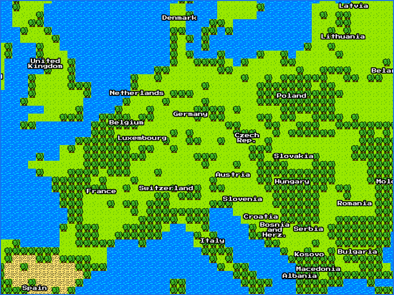

> This repo is a server part of "Google Maps 8-bit for NES" project
>
> Please watch this video to know more about it: https://youtu.be/5vcPnk-6saw

# 🗺️📍🎮 Mapnes
Backend for 8-bit maps for NES 

<div align="center" width="100%">
    
</div>

<br>
There are two layers:

- one constructed from raw Google maps images using 16x16 tiles
- one with layer of geospatial labels from NaturalEarth data rendered with Mapnik

## 🖼️ Tiles

While tiles from original video are similar to DragonQuest/DragonWarrior one, for obivous reasons I cannot release them publically. Tiles presented in this repo were modified from those tile sets:

- [8 bit color RPG tileset](https://opengameart.org/content/8-bit-color-rpg-tileset) (CC BY-SA 4.0 license)
- [8-bit JRPG tilesets](https://opengameart.org/content/8-bit-jrpg-tilesets) (CC0 1.0 license)
- [Some other 8-bit vertical shooter assets](https://opengameart.org/content/some-other-8-bit-vertical-shooter-assets) (CC0 1.0 license)

## ⛓️ Dependencies

Server is written in Python and running on [Flask](https://flask.palletsprojects.com/en/2.0.x/).
You should also install [Mapnik](https://mapnik.org/) for labels to work.

#### Ubuntu
Tested on Ubuntu 20.04.3 LTS with Python 3.8 and pip 20.0.2

```
pip install requests # network calls
pip install Flask # server
pip install Pillow # image library

sudo apt install libmapnik3.0 # cartographic library
sudp apt install python3-mapnik # mapnik bindings to python
```

⚠️ Note: If you installed Flask on local env, it may not find Mapnik installed globally. The easiest fix here is to install Flask globally as well.

#### Google API account

Google API key is required for map to load, you should register and get one following this guide https://developers.google.com/maps/documentation/javascript/get-api-key <br>
Once obtained, place it instead `YOUR_API_KEY` in [./static/index.html](./static/index.html)

If you have error message on load after that, make sure that:

- "Maps JavaScript API" is enabled in [the console](https://console.cloud.google.com/apis/library?project=mapnes)
- Billing account is created (Google API have free trial with no-auto charge after it's end)

## 👟 Run

`FLASK_ENV=development flask run --host=0.0.0.0`

You will be able access it directly in browser http://localhost:5000/ <br><br>
*In my setup I expose server to local network, so cartridge can connect to it too, that's why 0.0.0.0 binding is necessary.*

## 🙇 Acknowledgments

- [Custom tiles in Google Maps](https://gist.github.com/clhenrick/dcce31036d3e3940c55b31ddb86ca1ec)
- [Howto real time tiles rendering with mapnik and mod python](https://wiki.openstreetmap.org/wiki/Howto_real_time_tiles_rendering_with_mapnik_and_mod_python)
- [Creating “The Legend of Zelda” map tiles from Bing Maps aerial imagery](https://alastaira.wordpress.com/2012/03/14/creating-the-legend-of-zelda-map-tiles-from-bing-maps-aerial-imagery/)
